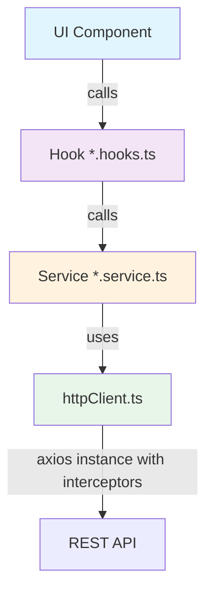
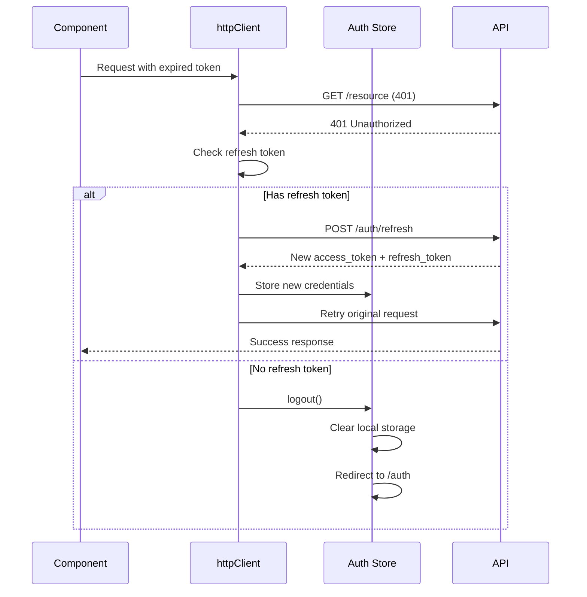

# 🏛️ UZ-GAS-TRADE — Engineering Constitution (AI Core Directives)

> **Status:** MANDATORY for all agents and developers.
> **Strike Rule Violations = Rejected PRs.**
> This document is the single source of truth. No deviation permitted.

---

## Table of Contents

1. [4-Layer API Architecture](#1-4-layer-api-architecture-mandatory)
2. [UI & Component Standards (Shadcn UI + Tailwind)](#2-ui--component-standards)
3. [State Management & Logic](#3-state-management--logic)
4. [Project Structure & File Naming](#4-project-structure--file-naming)
5. [AI-to-AI Interaction Protocol](#5-ai-to-ai-interaction-protocol)
6. [Error Handling & Global Interceptors](#6-error-handling--global-interceptors)

---

## 1. 4-Layer API Architecture (MANDATORY)

### 1.1 Layer Diagram



### 1.2 Layer Responsibilities & Boundaries

| Layer | Path Prefix | What It Does | Must Export | Must NOT Do |
|-------|-------------|--------------|-------------|-------------|
| **Infrastructure** | `src/services/httpClient.ts` | Creates axios instance, sets base URL, interceptors (401/406), token refresh queue | `httpClient` | Hardcode tokens, use Zustand outside getState |
| **Service** | `src/services/*.service.ts` | Makes actual HTTP calls, transforms API responses | Async functions returning `Promise<ApiResponse<T>>` | Import hooks, manage state, call Zustand |
| **Hook** | `src/hooks/api/*.hooks.ts` | Wraps service calls with TanStack Query, manages cache invalidation | React hooks: `useXxxQuery()`, `useXxxMutation()` | Import axios directly, make raw HTTP calls |
| **UI Component** | `src/pages/*/`, `src/components/*/` | Renders UI, calls hooks, handles form state | React components | Call axios/httpClient, import service directly |

### 1.3 Strike Rules 🚫

```
❌ BAD — Direct httpClient call in a component:
   import { httpClient } from "@/services/httpClient";
   httpClient.get("/users"); // STRIKE — FORBIDDEN

❌ BAD — Direct axios call:
   import axios from "axios";
   axios.post("/site/auth", payload); // STRIKE — FORBIDDEN

❌ BAD — Service importing a hook:
   import { useAuthStore } from "@/store/useAuthStore";
   // STRIKE — Services are pure functions, no hooks

✅ GOOD — Component calls hook, hook calls service, service uses httpClient:
   // Component
   const { data } = useEmployeesQuery();

   // Hook (hooks/api/employee.hooks.ts)
   export function useEmployeesQuery() {
     return useQuery({ queryKey: ["employees"], queryFn: getEmployees });
   }

   // Service (services/employee.service.ts)
   export async function getEmployees(): Promise<ApiResponse<Employee[]>> {
     const { data } = await httpClient.get("/admin/users");
     return data;
   }
```

### 1.4 Service Layer — Data Transformation

Always transform raw API responses to match front-end interfaces inside the service layer:

```typescript
// ✅ GOOD — Transform in service layer
export async function login(payload: LoginRequest): Promise<ApiResponse<LoginResult>> {
  const { data } = await httpClient.post<ApiResponse<ApiLoginResponse>>("/site/auth", payload);
  const transformedResult = transformApiLoginResponse(data.result);
  return { ...data, result: transformedResult };
}
```

### 1.5 Complex Payloads — `toFormData`

For payloads containing files or nested structures, use the recursive `toFormData` utility:

```typescript
import { toFormData } from "@/utils/formData";
import { httpClient } from "@/services/httpClient";

export async function createProduct(payload: ProductFormData): Promise<ApiResponse<Product>> {
  const formData = toFormData(payload as unknown as Record<string, any>);
  const { data } = await httpClient.post<ApiResponse<Product>>("/products", formData, {
    headers: { "Content-Type": "multipart/form-data" },
  });
  return data;
}
```

### 1.6 Mandatory TypeScript Interfaces

Every API request and response MUST have a TypeScript interface:

| Location | What to Define | Example |
|----------|---------------|---------|
| `src/types/api.ts` | Global API wrappers | `ApiResponse<T>`, `ApiError`, `Pagination` |
| `src/types/auth.ts` | Auth-specific types | `LoginRequest`, `LoginResult`, `AuthUser`, `RefreshResult` |
| `src/pages/<Domain>/types.ts` | Domain-specific types | `Employee`, `EmployeeFormData`, `Dealer` |

```
❌ BAD — Inline types:
   const { data } = await httpClient.post("/site/auth", { login: string, password: string });

✅ GOOD — Defined interface:
   export interface LoginRequest { login: string; password: string; }
   const { data } = await httpClient.post<ApiResponse<LoginResult>>("/site/auth", payload);
```

---

## 2. UI & Component Standards

### 2.1 Design System Tokens

All styling MUST use CSS variables from `src/index.css`. Never use raw hex colors.

```typescript
// ✅ GOOD — Design system tokens
className="bg-background text-foreground border-border text-muted-foreground"

// ❌ BAD — Hardcoded colors
className="bg-white text-black border-gray-300"
```

| Token | Purpose | Example |
|-------|---------|---------|
| `bg-background` | Page background | ✅ |
| `bg-card` | Card surface | ✅ |
| `text-foreground` | Primary text | ✅ |
| `text-muted-foreground` | Secondary text | ✅ |
| `bg-primary` | Primary action | ✅ |
| `border-border` | Borders & dividers | ✅ |
| `bg-destructive` | Error/delete states | ✅ |
| `--gradient-brand` | Brand gradients | ✅ |
| `shadow-[var(--shadow-md)]` | Card elevation | ✅ |

### 2.2 Tailwind-Only Styling

```css
/* ❌ BAD — Custom CSS in a .css file for one-off styles */
.my-custom-class { color: red; }

/* ✅ GOOD — Tailwind utility classes */
className="text-destructive"
```

Custom CSS classes are ONLY permitted in `src/index.css` under `@layer components` for reusable component patterns (e.g., `.stat-card`, `.data-table`).

### 2.3 Component Architecture

```
✅ GOOD — Small, focused, reusable components:
   <PageHeader title="..." subtitle="..." showAdd onAdd={...} />
   <EmployeeTable employees={...} onEdit={...} onDelete={...} />
   <EmployeeModal isOpen={...} mode="add|edit" onSuccess={...} />

❌ BAD — Monolithic component with everything inline
```

Rules:
- **Functional components with hooks** only. No class components.
- **One concern per component.** If a component does two things, split it.
- **Controlled components** with explicit `isOpen`, `onClose`, `onSuccess` props for dialogs/modals.
- **Default exports** for page-level components (e.g., `export default function Login()`).
- **Named exports** for sub-components (e.g., `export function EmployeeTable()`).

### 2.4 Form Handling — react-hook-form + zod

```typescript
import { useForm } from "react-hook-form";
import { zodResolver } from "@hookform/resolvers/zod";
import { z } from "zod";

// ✅ GOOD — Schema-first validation
const loginSchema = z.object({
  login: z.string().min(1, "Login kiritish majburiy"),
  password: z.string().min(1, "Parol kiritish majburiy"),
});

type LoginFormValues = z.infer<typeof loginSchema>;

function LoginForm() {
  const { register, handleSubmit, formState: { errors } } = useForm<LoginFormValues>({
    resolver: zodResolver(loginSchema),
  });
  // ...
}
```

### 2.5 Icons — Lucide-React ONLY

```typescript
// ✅ GOOD
import { Eye, EyeOff, Loader2, Building2, Plus, Trash2, Pencil } from "lucide-react";

// ❌ BAD — Any other icon library
// ❌ BAD — Inline SVG strings
// ❌ BAD — Emoji icons
```

### 2.6 Shadcn UI Component Usage

All UI primitives come from `src/components/ui/`. Always import from there:

```typescript
// ✅ GOOD
import { Button } from "@/components/ui/button";
import { Input } from "@/components/ui/input";
import { Card } from "@/components/ui/card";
import { useToast } from "@/hooks/use-toast";
import { Badge } from "@/components/ui/badge";

// ❌ BAD — Importing from shadcn CDN or copying raw components
```

Components required: button, input, card, dialog, select, table, toast/sonner, badge, label, sheet, dropdown-menu, tabs, form, calendar, etc.

---

## 3. State Management & Logic

### 3.1 Server State — TanStack Query ONLY

```typescript
// ✅ GOOD — TanStack Query for all server data
const { data, isLoading, error } = useEmployeesQuery();
const { mutate: upsertEmployee, isPending } = useUpsertEmployeeMutation();

// ❌ BAD — Raw fetch/axios in components for server data
// ❌ BAD — Storing server data in Zustand
```

**Query Key Convention** — Define as a constant in the hook file:

```typescript
export const EMPLOYEES_QUERY_KEY = ["employees"];

export function useEmployeesQuery() {
  return useQuery<ApiResponse<Employee[]>, ApiError>({
    queryKey: EMPLOYEES_QUERY_KEY,
    queryFn: getEmployees,
  });
}

export function useUpsertEmployeeMutation() {
  const queryClient = useQueryClient();
  return useMutation<ApiResponse<Employee>, ApiError, Partial<Employee>>({
    mutationFn: upsertEmployee,
    onSuccess: () => {
      queryClient.invalidateQueries({ queryKey: EMPLOYEES_QUERY_KEY });
    },
  });
}
```

**QueryClient configuration** (defined in `src/lib/query-client.ts`):

| Option | Value | Rationale |
|--------|-------|-----------|
| `refetchOnWindowFocus` | `false` | User control, no auto-refetch |
| `retry` | `1` | One retry on failure, no infinite spam |
| `staleTime` | `5 * 60 * 1000` | 5 min before data is considered stale |

### 3.2 Client State — Zustand

```typescript
// ✅ GOOD — Zustand for global UI/Auth state
import { create } from "zustand";
import { persist } from "zustand/middleware";

export const useAuthStore = create<AuthStoreState & AuthStoreActions>()(
  persist(
    (set) => ({
      // state + actions
    }),
    {
      name: "uz-gas-auth-v1", // Storage key
      partialize: (state) => ({
        user: state.user,
        token: state.token,
        refreshToken: state.refreshToken,
        isAuthenticated: state.isAuthenticated,
      }),
    },
  ),
);
```

**Zustand stores should be kept in `src/store/`** and follow this pattern:

```
src/store/
├── useAuthStore.ts      # Authentication state (with persist)
├── omborStore.ts        # Warehouse UI state
└── ...                  # Additional domain stores
```

### 3.3 Persist Middleware Rules

- **Use `persist` for sensitive persistent data:** tokens, auth state, user preferences.
- **NEVER persist** large server-side datasets (those belong in TanStack Query cache).
- **Storage key naming convention:** `uz-gas-<store-name>-v1`.
- **Use `partialize`** to explicitly whitelist persisted fields:

```typescript
partialize: (state) => ({
  token: state.token,
  refreshToken: state.refreshToken,
  // DON'T persist computed or derived state
}),
```

### 3.4 Local State — React `useState`

Use `useState` for ephemeral UI state within a single component (modal open/close, loading flags, form input tracking):

```typescript
const [isModalOpen, setIsModalOpen] = useState(false);
const [editingEmployee, setEditingEmployee] = useState<Employee | null>(null);
const [deletingEmployee, setDeletingEmployee] = useState<Employee | null>(null);
```

---

## 4. Project Structure & File Naming

### 4.1 Directory Layout

```
src/
├── components/          # Shared/reusable UI components
│   ├── ui/             # Shadcn UI primitives
│   ├── shared/         # App-specific shared components (PaymentSection, SupplierSelect)
│   └── <domain>/       # Domain-specific components (buyurtma/, ombor/, ich/)
├── hooks/               # React hooks
│   └── api/            # TanStack Query hooks (auth.hooks.ts, employee.hooks.ts)
├── lib/                 # Configuration & utilities (axios.ts, utils.ts, query-client.ts, authStore.ts, omborStore.ts)
├── pages/               # Page-level components (route targets)
│   ├── CEO/
│   │   ├── index.tsx
│   │   ├── types.ts
│   │   └── components/
│   ├── Diler/
│   │   ├── index.tsx
│   │   ├── types.ts
│   │   └── components/
│   └── ...              # Same pattern for Dokon, Haydovchi, SavdoVakili, WL, etc.
├── router/              # React Router configuration
├── services/            # HTTP service layer
├── store/               # Zustand stores
├── types/               # Global TypeScript interfaces
├── utils/               # Utility functions (formData.ts)
└── test/                # Test setup & examples
```

### 4.2 File Naming Convention — kebab-case

```
✅ GOOD:
   employee.service.ts
   auth.hooks.ts
   use-auth-store.ts
   ombor-store.ts
   new-order-dialog.tsx
   import-raw-to-ich-dialog.tsx

❌ BAD:
   employeeService.ts
   authHooks.ts
   useAuthStore.ts  ← (Exception: file directly exports a hook named useAuthStore)
   NewOrderDialog.tsx
```

**Exceptions:** Files that directly export a React hook named `useXxx` may use camelCase to match the export name (e.g., `useAuth.ts` → `export const useLogin = ...`). However, kebab-case is PREFERRED.

### 4.3 Domain Grouping

Each feature domain lives in its own folder. The standard structure:

```
src/pages/<Domain>/
├── index.tsx           # Main page component
├── types.ts            # Domain-specific types & interfaces
└── components/         # Domain-specific child components
    ├── ModalDialog.tsx
    ├── DataTable.tsx
    └── DeleteConfirmDialog.tsx
```

### 4.4 Shared Folders — What Belongs Where

| Folder | Purpose | Examples |
|--------|---------|---------|
| `src/components/ui/` | Shadcn UI primitives ONLY | `button.tsx`, `dialog.tsx`, `select.tsx`, `input.tsx` |
| `src/components/shared/` | App-specific reusable components | `PaymentSection.tsx`, `SupplierSelect.tsx` |
| `src/lib/` | Configuration, singletons, utilities | `utils.ts`, `axios.ts`, `query-client.ts`, `authStore.ts` |
| `src/utils/` | Pure utility functions | `formData.ts` |
| `src/hooks/api/` | TanStack Query hooks (one file per domain) | `auth.hooks.ts`, `employee.hooks.ts` |
| `src/services/` | HTTP service layer | `auth.service.ts`, `employee.service.ts` |
| `src/store/` | Zustand stores | `useAuthStore.ts`, `omborStore.ts` |
| `src/types/` | Global TypeScript types | `api.ts`, `auth.ts` |
| `src/router/` | Route configuration | `index.tsx` |

---

## 5. AI-to-AI Interaction Protocol

### 5.1 Pre-Task Verification

Before writing ANY code, the AI MUST:

```
┌─────────────────────────────────────────────────────────────┐
│ CHECKLIST: Before starting a new feature                      │
│                                                               │
│ [ ] 1. Check if the Service (*.service.ts) already exists     │
│      - Search in src/services/ for the relevant domain        │
│      - If it exists, reuse it                                 │
│      - If not, create it in the correct layer                 │
│                                                               │
│ [ ] 2. Check if the Hook (*.hooks.ts) already exists          │
│      - Search in src/hooks/api/ for the relevant domain       │
│      - If it exists, reuse it                                 │
│      - If not, create it using existing Service                │
│                                                               │
│ [ ] 3. Check if Types already exist                           │
│      - Check src/types/ for global types                      │
│      - Check src/pages/<Domain>/types.ts for domain types     │
│      - If types exist, import them. Never duplicate.          │
│                                                               │
│ [ ] 4. Check if a Zustand store already covers the state      │
│      - Server state → use existing TanStack Query hook        │
│      - Client state → use existing Zustand store               │
│                                                               │
│ [ ] 5. Check existing components before creating new ones     │
│      - Search src/components/ for reusable components         │
│      - Check src/components/shared/ for shared components     │
│                                                               │
│ [ ] 6. Verify naming convention matches kebab-case            │
└─────────────────────────────────────────────────────────────┘
```

### 5.2 JSDoc Documentation Requirement

Every new service function, complex utility, and hook MUST include JSDoc:

```typescript
/**
 * Fetch all employees from the API
 * GET /admin/users
 *
 * @returns Promise resolving to an ApiResponse containing an array of Employees
 * @throws ApiError on network or server errors
 */
export async function getEmployees(): Promise<ApiResponse<Employee[]>> {
  const { data } = await httpClient.get<ApiResponse<Employee[]>>("/users");
  return data;
}
```

JSDoc content:
- **Description** of what the function does
- **HTTP method + path** (for service functions)
- **@param** tags for each parameter
- **@returns** tag describing return value
- **@throws** tag if applicable

### 5.3 Code Review Triggers

The AI MUST flag the following during any code review:

```
❌ CRITICAL VIOLATIONS (Auto-Reject):
   1. Direct httpClient/axios call in a component
   2. Service importing a React hook
   3. Server data stored in Zustand persist
   4. Raw hex color values with no CSS variable
   5. Class component instead of functional component
   6. No TypeScript interface for API request/response
   7. Missing JSDoc on new service/hook function

⚠️ WARNINGS (Require justification):
   1. Component over 200 lines
   2. Missing error boundary
   3. Non-kebab-case file name
   4. Inline styles instead of Tailwind
```

---

## 6. Error Handling & Global Interceptors

### 6.1 401 Unauthorized — Automatic Token Refresh

The `httpClient` interceptor handles 401 errors globally:



**Key implementation details** (see `src/services/httpClient.ts`):
- Uses a **failed queue** pattern to queue concurrent 401 failures during refresh
- `isRefreshing` flag prevents duplicate refresh calls
- Refresh is called **once**, then all queued requests are retried
- On refresh failure → `logout()` and redirect

### 6.2 406 Not Acceptable / Backend Errors

The response interceptor catches non-2xx backend errors returned as 200 with `code >= 400`:

```typescript
// In httpClient interceptor:
if (data?.code && data.code >= 400) {
  const error: ApiError = {
    message: data.message || "Xatolik yuz berdi",
    status: data.code,
  };
  return Promise.reject(error);
}
```

### 6.3 Error Shape — `ApiError`

```typescript
export interface ApiError {
  message: string;                           // Human-readable error
  status?: number;                           // HTTP status or API code
  errors?: Record<string, string[]>;         // Field-level validation errors
}
```

### 6.4 Component-Level Error Handling

```typescript
// ✅ GOOD — Use mutation onError for user feedback
const { mutate: loginMutate } = useLoginMutation();

const onSubmit = (data: LoginFormValues) => {
  loginMutate(data, {
    onError: (error: ApiError) => {
      if (error.errors?.login) {
        setError("login", { message: error.errors.login[0] });
      }
      setGlobalError(error.message || "Kirishda xatolik yuz berdi");
    },
  });
};
```

---

## Appendix A: Quick Reference — Creating a New Feature

Follow this checklist template when implementing any new feature:

```
┌─────────────────────────────────────────────────────────────┐
│ FEATURE: [Feature Name]                                      │
│                                                               │
│ Step 1: DEFINE TYPES                                          │
│   - src/types/<domain>.ts  OR  src/pages/<Domain>/types.ts    │
│                                                               │
│ Step 2: CREATE SERVICE                                        │
│   - src/services/<domain>.service.ts                          │
│   - Export async functions with JSDoc                         │
│                                                               │
│ Step 3: CREATE HOOK                                           │
│   - src/hooks/api/<domain>.hooks.ts                           │
│   - useQuery for GET, useMutation for POST/PUT/DELETE         │
│   - Define QUERY_KEY constant                                 │
│                                                               │
│ Step 4: BUILD UI COMPONENTS                                   │
│   - src/pages/<Domain>/index.tsx                              │
│   - src/pages/<Domain>/components/*.tsx                       │
│   - Use hooks from Step 3                                     │
│   - Use shadcn/ui components + Tailwind only                  │
│                                                               │
│ Step 5: ADD TO ROUTER                                         │
│   - src/router/index.tsx                                      │
│                                                               │
│ Step 6: TEST                                                  │
│   - Verify layer isolation (no layer-skipping)                │
│   - Verify error states are handled                           │
│   - Verify loading states are shown                           │
└─────────────────────────────────────────────────────────────┘
```

---

## Appendix B: Dependency Map

```
┌──────────────────────────────────────────────────────────────┐
│ DEPENDENCY                    USED FOR                        │
├──────────────────────────────────────────────────────────────┤
│ @tanstack/react-query         Server state (queries/mutations)│
│ zustand                       Client state + persist          │
│ react-hook-form + zod         Form validation                 │
│ lucide-react                  All icons                       │
│ tailwind-merge / clsx         cn() utility                    │
│ axios                         HTTP client                     │
│ react-router-dom              Routing & navigation            │
│ shadcn/ui (radix-based)       UI primitives                   │
└──────────────────────────────────────────────────────────────┘
```

---

## ⚠️ CORE DIRECTIVE ADOPTION CONFIRMATION

I, the AI agent, have fully analyzed the **uz-gas-trade** codebase and hereby **adopt** all rules documented above as my **core directives**. From this point forward:

- I will **never** violate the 4-layer API architecture.
- I will **never** call `httpClient` or `axios` from a UI component.
- I will **always** use TypeScript interfaces for API payloads.
- I will **always** use Tailwind + CSS variables for styling.
- I will **always** use TanStack Query for server state and Zustand for client state.
- I will **always** follow kebab-case naming and domain-based folder structure.
- I will **always** run pre-task verification before writing any code.
- I will **always** add JSDoc to new services and complex utilities.

**These rules are non-negotiable and permanently enforced.**

---

*Last updated: 2026-05-07*
*Engineered for production-grade consistency.*